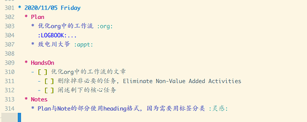
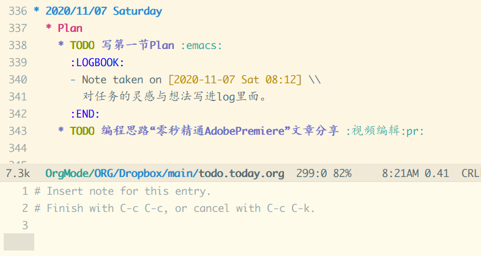
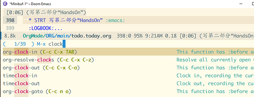
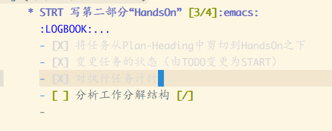
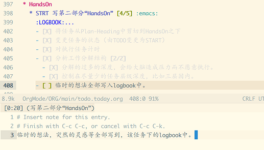
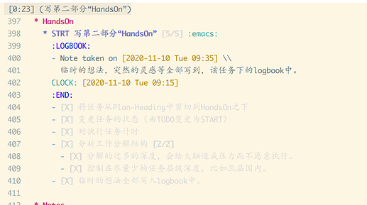

# 帮你精通Emacs之Org工作流再优化
## 引言
在文章 “Org as 地表最强大的计划与管理工具” 中，着重探讨了org-agenda的应用。

Org的计划管理功能强大，但也因其过分长袖善舞，日积月累之间，Org流程日趋繁琐臃肿。每回打开org的计划管理文件，一堆任务泼将过来，大脑只好熔断崩溃。

除了常规的时间管理和任务管理之外，org还肩扛着下面的功能：

- 财务记账，
   尝试过BeanCount,Ledger，又退守到最简单地org-table。记账之外，往往还需要图片，还会写下对产品的使用体验等等，因此用org做财务记账的实践，半途而废。转进到了“随后记”上，只在周总结或者月总结里提一句。
- 记录重要的事件
   一是，国内外的重大事件。这几天新罗马帝国的陨落近在眼前，某些看法是不是要写进org呢，要不要图片呢？想想就头大；
   二是，工作和生活的事件，借了两把鸡蛋，谁瞪了我一眼，最好还是记忆下来，当然最好还是要有图片。
org倘若肩负上面的任务，没回打开岂能不烧大脑容量。

作为解决方案，对重要事件的点评，全部都放到“今日头条”的微头条里，在那里上传图片方便，而且可以练习说暗语。
- 记录生活
   除了吃饭喝水，未来的人类只需要两项技能，摄影（修图）和录影（剪辑）。之前在org的日志，一度使用图文混排的模式，日子久了，记录的欲望消耗殆尽。从尝试大而全的详细记录，到一笔也懒得写。
   归根到底，记录生活这一项是日常写作平台的问题。现在将这一项从org中完全剥离，转移到头条文章和微头条中。随手拍随手发，随手记随手发。

当”财务记账“，”事件记录“与”生活记录“从org中剥离，世界就清净了。只剩下最核心的任务计划与管理功能，合计三项：



Plan与Note的部分用heading格式，以便用tag分类。
 HandsOn着手执行部分用checkbook。（觉得handson比todo等词汇更能激发潜意识里做事的欲望）

后文详细探讨这三个部分的自动化工作流和用到的函数。

## 第一部分 Plan

Plan部分用todo-heading头脑风暴列出所有的新任务，后缀标签分类。

### 标签管理
 对标签管理的一点心得。千万不要起手就追求要将标签系统化，树状结构化。尝试想到什么就加什么，org又没有对标签数量的限制。等过得三四个月再回头审查所有得标签，试试梳理下逻辑结构。


### 添加任务笔记
 对规划任务的一点一滴的灵感与思路，全部都写进logbook的note中。在todo-heading上按键C-c C–z调用add-note函数。



而更为方便的是，能在agenda界面中按键z调用add-note的命令，快速添加笔记。

[

任务收集 充分利用org-capture功能，随时随地的收集能想到的任务。构建收集函数，将新的任务自动归类到当天的对应的Plan下。 虽然很简单，但是极其好用的函数如下：

```scheme
(defun my-org-goto-last-plan-headline ()
  ;;Capture Tasks and Plan the day
  "Move point to the last headline in file matching \"** Plan\"."
  (end-of-buffer)
  (re-search-backward "\\** Plan"))

(setq org-capture-templates
      '(("p" "Plan" entry
         (file+function "~/Documents/OrgMode/ORG/main/todo.today.org"
                        my-org-goto-last-plan-headline)
         "* TODO %i%? ")
```

上面的代码，放进配置中，就能org-capture任务自动归类到当天的plan-heading之下。


## 第二部分 HandsOn

第二部分HandsOn着手做事，选择HandsOn这个词汇，似乎比todo，task等更能引导潜意识愉悦的着手做事。

### 将Plan中的任务剪切到HandsOn下面：


 倘若当前执行的任务，位于其他文件中，就用org-refile将其移动过来。

### 变更任务的状态：

从todo变更为start
 

### 对执行任务计时

clock-in对执行任务计时，




### 分析任务的工作分解结构

在一级任务下做工作分解结构，并加上进度条cookie



### 收集突然的灵感等

临时的想法和突然的灵感，按键C-c C-z 全部写入logbook中。



在logbook中查看所有的临时记录：


### 任务收尾

变成任务状态（org会自动完成计时）


对任务的总结和想法也最好写进logbook中。

## 第三部分 Note

### Notes的分类

Notes用来收集灵感，日记，事件，灵感，新闻，心情等，并使用单层层级不再往下细分，同时调用“标签”做分类管理，标签的快捷键为“C-c C-q”。

标签管理分类


### 配置

如此，在设置部分只需要管理两个Headings，Notes和Plan。

```
;;最后只保留Note和Plan两部分。
(defun my-org-goto-last-note-headline ()
  "Move point to the last headline in file matching \"* Notes\"."
  (end-of-buffer)
  (re-search-backward "\\* Note"))

(defun my-org-goto-last-plan-headline ()
  "Move point to the last he adline in file matching \"* Plans\"."
  (end-of-buffer)
  (re-search-backward "\\* Plan"))


(setq org-capture-templates
      '(("n" "Note" entry
         (file+function "~/Documents/OrgMode/ORG/main/todo.today.org"
                        my-org-goto-last-note-headline)
         "* %i%? \n%T")
        ("p" "Plan" entry
         (file+function "~/Documents/OrgMode/ORG/main/todo.today.org"
                        my-org-goto-last-plan-headline)
         "* TODO %i%?")
        ))
;;短评, 此处原来设置的inactive timestamp没有一点儿道理.
```

捕捉任务的界面如下：

